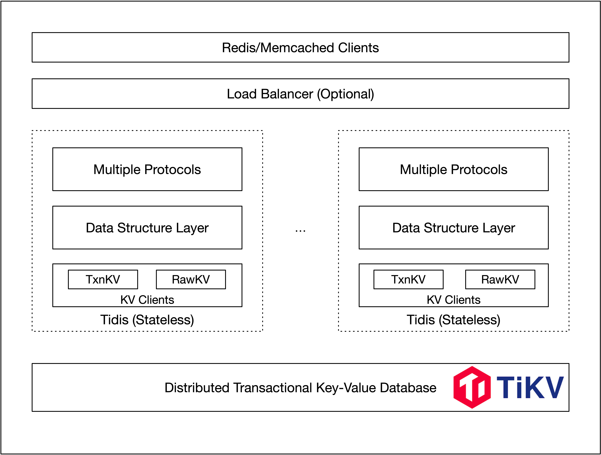

# Tidis

[](https://github.com/tidbcloud/tikv-service/actions/workflows/ci.yml)

`Tidis` is the service layer for TiKV, aims to provide multiple model distributed storage service powered by PingCAP. 

`Tidis` has been completely refactoring and rewritten by `Rust` for better performace and lower latency, and added more features support, such as Lua scripts, TLS connections, meta key split and more.

- [x] Redis
- [ ] Memcached

## Features

* Multiple protocol supported*
* Linear scale-out ability
* Storage and computation separation
* Data safety, no data loss, raft replication
* Global transaction support

## Architecture

*Architechture of Tidis*



*Architechture of TiKV*


- Placement Driver (PD): PD is the brain of the TiKV system which manages the metadata about Nodes, Stores, Regions mapping, and makes decisions for data placement and load balancing. PD periodically checks replication constraints to balance load and data automatically.
- Node: A physical node in the cluster. Within each node, there are one or more Stores. Within each Store, there are many Regions.
- Store: There is a RocksDB within each Store and it stores data in local disks.
- Region: Region is the basic unit of Key-Value data movement and corresponds to a data range in a Store. Each Region is replicated to multiple Nodes. These multiple replicas form a Raft group. A replica of a Region is called a Peer.

## Running

- Start `PD`, `TiKV` and one `TiDB` (for trigger GC) using `TiUP`, you can be follow the official instructions [English](https://docs.pingcap.com/tidb/stable/production-deployment-using-tiup) or [中文](https://docs.pingcap.com/zh/tidb/stable/production-deployment-using-tiup).

- Build the Tidis server

```
cargo build -r
```

- Start the Tidis server

```
tidis-server --config config.toml
```

You can use the demo configuration below.

``` toml
[server]
listen = "0.0.0.0"
port = 6379                               # disable tcp port if set to 0
tls_listen = "0.0.0.0"
tls_port = 6443                           # disable tls if tls_port set to 0
tls_key_file = ""                         # disable tls if key or cert file not set
tls_cert_file = ""
tls_auth_client = false                   # tls_ca_cert_file must be specified if tls_auth_client is true
tls_ca_cert_file = "path/ca.crt"
pd_addrs = "127.0.0.1:2379"               # PD addresses of the TiKV cluster
instance_id = "1"                         # instance_id can be used as tenant identifier
prometheus_listen = "0.0.0.0"
prometheus_port = 8080
log_level = "info"
log_file = "tidis.log"

[backend]
use_txn_api = true                        # use transaction api for full api supported
use_async_commit = true                   # try to use async commit in tikv
try_one_pc_commit = true                  # try to use one pc commit
use_pessimistic_txn = true                # use optimistic transaction mode
local_pool_number = 4                     # localset pool number for handle connections
txn_retry_count = 10                      # transaction retry count
txn_region_backoff_delay_ms = 2           # transaction region error backoff base delay time
txn_region_backoff_delay_attemps = 2      # transaction region error backoff retry max attempts
txn_lock_backoff_delay_ms = 2             # transaction lock error backoff base delay time
txn_lock_backoff_delay_attemps = 5        # transaction lock error backoff retry max attempts
```

- Run clients

For redis protocol, you can use the official redis clients, such as `redis-cli`.

```
redis-cli -p 6379
tidis> SET mykey "Hello"
"OK"
tidis> GET mykey
"Hello"
tidis> EXPIRE mykey 10
(integer) 1
# 10 seconds later
tidis> GET mykey
(nil)
tidis> RPUSH mylist "one"
(integer) 1
tidis> RPUSH mylist "two"
(integer) 2
tidis> RPUSH mylist "three"
(integer) 3
tidis> LRANGE mylist 0 0
1) "one"
tidis> LRANGE mylist -3 2
1) "one"
2) "two"
3) "three"
tidis> LRANGE mylist -100 100
1) "one"
2) "two"
3) "three"
tidis> LRANGE mylist 5 10
(nil)
tidis> ZADD myzset 1 "one"
(integer) 1
tidis> ZADD myzset 2 "two"
(integer) 1
tidis> ZADD myzset 3 "three"
(integer) 1
tidis> ZREMRANGEBYSCORE myzset 0 1
(integer) 1
tidis> ZRANGE myzset 0 5 WITHSCORES
1) "two"
2) "2"
3) "three"
4) "3"
```

## TLS/SSL support

### 1. Generate tls certs and key for test

``` bash
#!/bin/bash

# Generate some test certificates which are used by the regression test suite:
#
#   tests/tls/ca.{crt,key}          Self signed CA certificate.
#   tests/tls/redis.{crt,key}       A certificate with no key usage/policy restrictions.
#   tests/tls/client.{crt,key}      A certificate restricted for SSL client usage.
#   tests/tls/server.{crt,key}      A certificate restricted for SSL server usage.

generate_cert() {
    local name=$1
    local cn="$2"
    local opts="$3"

    local keyfile=tests/tls/${name}.key
    local certfile=tests/tls/${name}.crt

    [ -f $keyfile ] || openssl genrsa -out $keyfile 2048
    openssl req \
        -new -sha256 \
        -subj "/O=Redis Test/CN=$cn" \
        -key $keyfile | \
        openssl x509 \
            -req -sha256 \
            -CA tests/tls/ca.crt \
            -CAkey tests/tls/ca.key \
            -CAserial tests/tls/ca.txt \
            -CAcreateserial \
            -days 365 \
            $opts \
            -out $certfile
}

mkdir -p tests/tls
[ -f tests/tls/ca.key ] || openssl genrsa -out tests/tls/ca.key 4096
openssl req \
    -x509 -new -nodes -sha256 \
    -key tests/tls/ca.key \
    -days 3650 \
    -subj '/O=Redis Test/CN=Certificate Authority' \
    -out tests/tls/ca.crt

cat > tests/tls/openssl.cnf <<_END_
[ server_cert ]
keyUsage = digitalSignature, keyEncipherment
nsCertType = server

[ client_cert ]
keyUsage = digitalSignature, keyEncipherment
nsCertType = client
_END_

generate_cert server "Server-only" "-extfile tests/tls/openssl.cnf -extensions server_cert"
generate_cert client "Client-only" "-extfile tests/tls/openssl.cnf -extensions client_cert"
generate_cert redis "Generic-cert"
```

### 2. Server and client config

- Server-side

``` toml
tls_listen = "0.0.0.0"
tls_port = 6443
tls_key_file = "path/server.key"
tls_cert_file = "path/server.crt"
tls_auth_client = false           # tls_ca_cert_file must be specified if tls_auth_client is true
tls_ca_cert_file = "path/ca.crt"
```

- Client-side

tls_auth_client is false, client just use root ca certificate

``` shell
./src/redis-cli --tls --cacert ./tests/tls/ca.crt
```

tls_auth_client is true, client must be configure certs and key file for client auth in server side

``` shell
./src/redis-cli --tls  --cert ./tests/tls/client.crt --key ./tests/tls/client.key --cacert ./tests/tls/ca.crt
```

## Global transaction

Thanks to the global transaction of `TiKV` cluster, `Tidis` can support the global transaction easily. Use `MULTI/EXEC/DISCARD` command just like `Redis Cluster` but without caring about the `CROSSSLOT` error, just use it like a single `Redis` instance.

## Lua Script

`Tidis` use `mlua` library to interpret lua scripts. We can use `EVAL/EVALSHA` to execute lua script with global transaction support, without caring about the `CROSSSLOT` error either.

## Async key deletion

For collection keys with thousands of items, deletion will be a time-costing operation, enable the async deletion configuration could greatly reduce the operation time, from seconds to milliseconds.

## Super batch feature support

Use super batch enabled could have obvious performance optimization, but you can tunning it by your business pressure.

```
allow_batch = true
max_batch_wait_time = 10
max_batch_size = 20
max_inflight_requests = 10000
overload_threshold = 0
```

## E2e tests

You can run complete sets of all supported commands using the tools provided in the repo test directory, just run

```
python3 test_helper.py [--ip ip] [--port 6379]
```

## Supported commands

### Keys

    +-----------+-------------------------------------+
    |  pexpire  | pexpire key int                     |
    +-----------+-------------------------------------+
    | pexpireat | pexpireat key timestamp(ms)         |
    +-----------+-------------------------------------+
    |   expire  | expire key int                      |
    +-----------+-------------------------------------+
    |  expireat | expireat key timestamp(s)           |
    +-----------+-------------------------------------+
    |    pttl   | pttl key                            |
    +-----------+-------------------------------------+
    |    ttl    | ttl key                             |
    +-----------+-------------------------------------+
    |    type   | type key                            |
    +-----------+-------------------------------------+
    |    scan   | scan "" [count 10] [match "^pre*"]  |
    +-----------+-------------------------------------+
    |    ping   | ping                                |
    +-----------+-------------------------------------+

### String

    +-----------+-------------------------------------+
    |  command  |               format                |
    +-----------+-------------------------------------+
    |    get    | get key                             |
    +-----------+-------------------------------------+
    |    set    | set key value [EX sec|PX ms][NX|XX] | 
    +-----------+-------------------------------------+
    |    del    | del key1 key2 ...                   |
    +-----------+-------------------------------------+
    |    mget   | mget key1 key2 ...                  |
    +-----------+-------------------------------------+
    |    mset   | mset key1 value1 key2 value2 ...    |
    +-----------+-------------------------------------+
    |    incr   | incr key                            |
    +-----------+-------------------------------------+
    |   incrby  | incr key step                       |
    +-----------+-------------------------------------+
    |    decr   | decr key                            |
    +-----------+-------------------------------------+
    |   decrby  | decrby key step                     |
    +-----------+-------------------------------------+
    |   strlen  | strlen key                          |
    +-----------+-------------------------------------+

### Hash

    +------------+------------------------------------------+
    |  Commands  | Format                                   |
    +------------+------------------------------------------+
    |    hget    | hget key field                           |
    +------------+------------------------------------------+
    |   hstrlen  | hstrlen key field                        |
    +------------+------------------------------------------+
    |   hexists  | hexists key field                        |
    +------------+------------------------------------------+
    |    hlen    | hlen key                                 |
    +------------+------------------------------------------+
    |    hmget   | hmget key field1 field2 field3...        |
    +------------+------------------------------------------+
    |    hdel    | hdel key field1 field2 field3...         |
    +------------+------------------------------------------+
    |    hset    | hset key field value                     |
    +------------+------------------------------------------+
    |   hsetnx   | hsetnx key field value                   |
    +------------+------------------------------------------+
    |    hmset   | hmset key field1 value1 field2 value2... |
    +------------+------------------------------------------+
    |    hkeys   | hkeys key                                |
    +------------+------------------------------------------+
    |    hvals   | hvals key                                |
    +------------+------------------------------------------+
    |   hgetall  | hgetall key                              |
    +------------+------------------------------------------+
    |   hincrby  | hincrby key step                         |
    +------------+------------------------------------------+

### List

    +------------+---------------------------------------------+
    |  commands  |         format                              |
    +------------+---------------------------------------------+
    |    lpop    | lpop key                                    |
    +------------+---------------------------------------------+
    |    rpush   | rpush key  item                             |
    +------------+---------------------------------------------+
    |    lpush   | lpush key  item                             |
    +------------+---------------------------------------------+
    |    rpop    | rpop key                                    |
    +------------+---------------------------------------------+
    |    llen    | llen key                                    |
    +------------+---------------------------------------------+
    |   lindex   | lindex key index                            |
    +------------+---------------------------------------------+
    |   lrange   | lrange key start stop                       |
    +------------+---------------------------------------------+
    |    lset    | lset key index value                        |
    +------------+---------------------------------------------+
    |    ltrim   | ltrim key start stop                        |
    +------------+---------------------------------------------+
    |   linsert  | linsert key <BEFORE | AFTER> pivot element  |
    +------------+---------------------------------------------+

### Set

    +-------------+-------------------------------------+
    |   commands  |             format                  |
    +-------------+-------------------------------------+
    |     sadd    | sadd key member1 [member2 ...]      |
    +-------------+-------------------------------------+
    |    scard    | scard key                           |
    +-------------+-------------------------------------+
    |  sismember  | sismember key member                |
    +-------------+-------------------------------------+
    |  smismember | smismember key member [member2 ...] |
    +-------------+-------------------------------------+
    |   smembers  | smembers key                        |
    +-------------+-------------------------------------+
    |     srem    | srem key member                     |
    +-------------+-------------------------------------+
    |     spop    | spop key [count]                    |
    +-------------+-------------------------------------+
    | srandmember | spop key [count]                    |
    +-------------+-------------------------------------+

### Sorted set

    +------------------+---------------------------------------------------------------+
    |     commands     |                             format                            |
    +------------------+---------------------------------------------------------------+
    |       zadd       | zadd key member1 score1 [member2 score2 ...]                  |
    +------------------+---------------------------------------------------------------+
    |       zcard      | zcard key                                                     |
    +------------------+---------------------------------------------------------------+
    |      zrange      | zrange key start stop [WITHSCORES]                            |
    +------------------+---------------------------------------------------------------+
    |     zrevrange    | zrevrange key start stop [WITHSCORES]                         |
    +------------------+---------------------------------------------------------------+
    |   zrangebyscore  | zrangebyscore key min max [WITHSCORES][LIMIT offset count]    |
    +------------------+---------------------------------------------------------------+
    | zrevrangebyscore | zrevrangebyscore key max min [WITHSCORES][LIMIT offset count] |
    +------------------+---------------------------------------------------------------+
    | zremrangebyscore | zremrangebyscore key min max                                  |
    +------------------+---------------------------------------------------------------+
    | zremrangebyrank  | zremrangebyscore key start stop                               |
    +------------------+---------------------------------------------------------------+
    |      zcount      | zcount key                                                    |
    +------------------+---------------------------------------------------------------+
    |      zscore      | zscore key member                                             |
    +------------------+---------------------------------------------------------------+
    |      zrank       | zrank key member                                              |
    +------------------+---------------------------------------------------------------+
    |       zrem       | zrem key member1 [member2 ...]                                |
    +------------------+---------------------------------------------------------------+
    |      zpopmin     | zpopmin key [count]                                           |
    +------------------+---------------------------------------------------------------+
    |      zpopmax     | zpopmax key [count]                                           |
    +------------------+---------------------------------------------------------------+
    |      zincrby     | zincrby key increment member                                  |
    +------------------+---------------------------------------------------------------+

### Lua

    +-------------+-----------------------------------------------------+
    |   commands  |             format                                  |
    +-------------+-----------------------------------------------------+
    |     eval    | eval script numkeys [key [key ...]] [arg [arg ...]] |
    +-------------+-----------------------------------------------------+
    |    evalsha  | evalsha sha1 numkeys [key [key ...]] [arg [arg ...]]|
    +-------------+-----------------------------------------------------+
    | script load | script load script                                  |
    +-------------+-----------------------------------------------------+
    | script flush| script flush                                        |
    +-------------+-----------------------------------------------------+
    |script exists| script exists sha1 [sha1 ...]                       |
    +-------------+-----------------------------------------------------+

### Security

    +-------------+----------------------+
    |   commands  |      format          |
    +-------------+----------------------+
    |    auth     | auth password        |
    +-------------+----------------------+


### Debug

    +-------------+----------------------+
    |   commands  |      format          |
    +-------------+----------------------+
    |    debug    | debug profiler_start |
    +-------------+----------------------+
    |    debug    | debug profiler_stop  |
    +-------------+----------------------+

### Cluster

    +-----------------+------------+
    |   command       |    support |
    +-----------------+------------+
    |  cluster nodes  |    Yes     |
    +-----------------+------------+
    |  cluster info   |    Yes     |
    +-----------------+------------+


### Transaction

    +---------+---------+
    | command | support |
    +---------+---------+
    |  multi  | Yes     |
    +---------+---------+
    |   exec  | Yes     |
    +---------+---------+
    | discard | Yes     |
    +---------+---------+

### Client Management

    +-----------------+------------+
    |   command       |    support |
    +-----------------+------------+
    |  client setname |    Yes     |
    +-----------------+------------+
    |  client getname |    Yes     |
    +-----------------+------------+
    |  client id      |    Yes     |
    +-----------------+------------+
    |  client list    |    Yes     |
    +-----------------+------------+
    |  client kill    |    Yes     |
    +-----------------+------------+

## Performance

See details [Benchmark](./docs/performance.md) here. 

## License

Tidis is under the Apache-2.0 license. See the [LICENSE](./LICENSE) file for details.

## Acknowledgment

* Thanks [PingCAP](https://github.com/pingcap) for providing [TiKV](https://github.com/pingcap/tikv) and [PD](https://github.com/pingcap/pd) powerful components.
