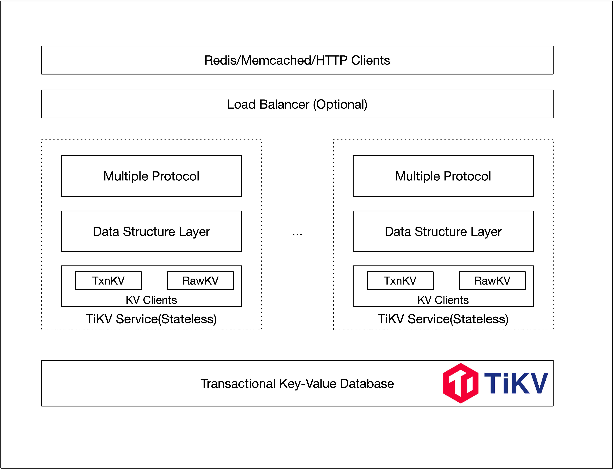

# TiKV-Service

`TiKV-Service` is the service layer for TiKV, aims to provide multiple model distributed storage service powered by PingCAP.

- [x] Redis
- [ ] Memcached
- [ ] DynamoDB

## Features

* Multiple protocol supported
* Linear scale-out ability
* Storage and computation separation
* Data safety, no data loss, Raft replication
* Transaction support

## Architecture

*Architechture of TiKV-Service*



*Architechture of TiKV*


- Placement Driver (PD): PD is the brain of the TiKV system which manages the metadata about Nodes, Stores, Regions mapping, and makes decisions for data placement and load balancing. PD periodically checks replication constraints to balance load and data automatically.
- Node: A physical node in the cluster. Within each node, there are one or more Stores. Within each Store, there are many Regions.
- Store: There is a RocksDB within each Store and it stores data in local disks.
- Region: Region is the basic unit of Key-Value data movement and corresponds to a data range in a Store. Each Region is replicated to multiple Nodes. These multiple replicas form a Raft group. A replica of a Region is called a Peer.

## Running

- Start `PD`, `TiKV` and one `TiDB` (for trigger GC) using `TiUP`, you can be follow the official instructions [English](https://docs.pingcap.com/tidb/stable/production-deployment-using-tiup) or [中文](https://docs.pingcap.com/zh/tidb/stable/production-deployment-using-tiup).

- Build the TiKV-Service server

```
cargo build -r
```

- Start the TiKV-Service server

```
tikv-service-server --config config.toml
```

You can use the demo configuration below.

``` toml
[server]
listen = "0.0.0.0"
port = 6379                               # disable tcp port if set to 0
tls_listen = "0.0.0.0"
tls_port = 6443                           # disable tls if tls_port set to 0
tls_key_file = ""                         # disable tls if key or cert file not set
tls_cert_file = ""
pd_addrs = "127.0.0.1:2379"               # PD addresses of the TiKV cluster
instance_id = "1"                         # instance_id can be used as tenant identifier
prometheus_listen = "0.0.0.0"
prometheus_port = 8080
log_level = "info"
log_file = "tikv-service.log"

[backend]
use_txn_api = true                        # use transaction api for full api supported
use_async_commit = true                   # try to use async commit in tikv
try_one_pc_commit = true                  # try to use one pc commit
use_pessimistic_txn = true                # use optimistic transaction mode
local_pool_number = 4                     # localset pool number for handle connections
txn_retry_count = 10                      # transaction retry count
txn_region_backoff_delay_ms = 2           # transaction region error backoff base delay time
txn_region_backoff_delay_attemps = 2      # transaction region error backoff retry max attempts
txn_lock_backoff_delay_ms = 2             # transaction lock error backoff base delay time
txn_lock_backoff_delay_attemps = 5        # transaction lock error backoff retry max attempts
```

- Run clients

For redis protocol, you can use the official redis clients, such as `redis-cli`.

```
redis-cli -p 6379
tikv-service> SET mykey "Hello"
"OK"
tikv-service> GET mykey
"Hello"
tikv-service> EXPIRE mykey 10
(integer) 1
# 10 seconds later
tikv-service> GET mykey
(nil)
tikv-service> RPUSH mylist "one"
(integer) 1
tikv-service> RPUSH mylist "two"
(integer) 2
tikv-service> RPUSH mylist "three"
(integer) 3
tikv-service> LRANGE mylist 0 0
1) "one"
tikv-service> LRANGE mylist -3 2
1) "one"
2) "two"
3) "three"
tikv-service> LRANGE mylist -100 100
1) "one"
2) "two"
3) "three"
tikv-service> LRANGE mylist 5 10
(nil)
tikv-service> ZADD myzset 1 "one"
(integer) 1
tikv-service> ZADD myzset 2 "two"
(integer) 1
tikv-service> ZADD myzset 3 "three"
(integer) 1
tikv-service> ZREMRANGEBYSCORE myzset 0 1
(integer) 1
tikv-service> ZRANGE myzset 0 5 WITHSCORES
1) "two"
2) "2"
3) "three"
4) "3"
```

## E2e tests

You can run complete sets of all supported commands using the tools provided in the repo test directory, just run

```
python3 test_helper.py [--ip ip] [--port 6379]
```

## Supported commands

### Keys

    +-----------+-------------------------------------+
    |  pexpire  | pexpire key int                     |
    +-----------+-------------------------------------+
    | pexpireat | pexpireat key timestamp(ms)         |
    +-----------+-------------------------------------+
    |   expire  | expire key int                      |
    +-----------+-------------------------------------+
    |  expireat | expireat key timestamp(s)           |
    +-----------+-------------------------------------+
    |    pttl   | pttl key                            |
    +-----------+-------------------------------------+
    |    ttl    | ttl key                             |
    +-----------+-------------------------------------+
    |    type   | type key                            |
    +-----------+-------------------------------------+

### String

    +-----------+-------------------------------------+
    |  command  |               format                |
    +-----------+-------------------------------------+
    |    get    | get key                             |
    +-----------+-------------------------------------+
    |    set    | set key value [EX sec|PX ms][NX|XX] | 
    +-----------+-------------------------------------+
    |    del    | del key1 key2 ...                   |
    +-----------+-------------------------------------+
    |    mget   | mget key1 key2 ...                  |
    +-----------+-------------------------------------+
    |    mset   | mset key1 value1 key2 value2 ...    |
    +-----------+-------------------------------------+
    |    incr   | incr key                            |
    +-----------+-------------------------------------+
    |   incrby  | incr key step                       |
    +-----------+-------------------------------------+
    |    decr   | decr key                            |
    +-----------+-------------------------------------+
    |   decrby  | decrby key step                     |
    +-----------+-------------------------------------+
    |   strlen  | strlen key                          |
    +-----------+-------------------------------------+

### Hash

    +------------+------------------------------------------+
    |  Commands  | Format                                   |
    +------------+------------------------------------------+
    |    hget    | hget key field                           |
    +------------+------------------------------------------+
    |   hstrlen  | hstrlen key field                        |
    +------------+------------------------------------------+
    |   hexists  | hexists key field                        |
    +------------+------------------------------------------+
    |    hlen    | hlen key                                 |
    +------------+------------------------------------------+
    |    hmget   | hmget key field1 field2 field3...        |
    +------------+------------------------------------------+
    |    hdel    | hdel key field1 field2 field3...         |
    +------------+------------------------------------------+
    |    hset    | hset key field value                     |
    +------------+------------------------------------------+
    |   hsetnx   | hsetnx key field value                   |
    +------------+------------------------------------------+
    |    hmset   | hmset key field1 value1 field2 value2... |
    +------------+------------------------------------------+
    |    hkeys   | hkeys key                                |
    +------------+------------------------------------------+
    |    hvals   | hvals key                                |
    +------------+------------------------------------------+
    |   hgetall  | hgetall key                              |
    +------------+------------------------------------------+

### List

    +------------+-----------------------+
    |  commands  |         format        |
    +------------+-----------------------+
    |    lpop    | lpop key              |
    +------------+-----------------------+
    |    rpush   | rpush key  item       |
    +------------+-----------------------+
    |    lpush   | lpush key  item       |
    +------------+-----------------------+
    |    rpop    | rpop key              |
    +------------+-----------------------+
    |    llen    | llen key              |
    +------------+-----------------------+
    |   lindex   | lindex key index      |
    +------------+-----------------------+
    |   lrange   | lrange key start stop |
    +------------+-----------------------+
    |    lset    | lset key index value  |
    +------------+-----------------------+
    |    ltrim   | ltrim key start stop  |
    +------------+-----------------------+

### Set

    +-------------+-------------------------------------+
    |   commands  |             format                  |
    +-------------+-------------------------------------+
    |     sadd    | sadd key member1 [member2 ...]      |
    +-------------+-------------------------------------+
    |    scard    | scard key                           |
    +-------------+-------------------------------------+
    |  sismember  | sismember key member                |
    +-------------+-------------------------------------+
    |  smismember | smismember key member [member2 ...] |
    +-------------+-------------------------------------+
    |   smembers  | smembers key                        |
    +-------------+-------------------------------------+
    |     srem    | srem key member                     |
    +-------------+-------------------------------------+
    |     spop    | spop key [count]                    |
    +-------------+-------------------------------------+

### Sorted set

    +------------------+---------------------------------------------------------------+
    |     commands     |                             format                            |
    +------------------+---------------------------------------------------------------+
    |       zadd       | zadd key member1 score1 [member2 score2 ...]                  |
    +------------------+---------------------------------------------------------------+
    |       zcard      | zcard key                                                     |
    +------------------+---------------------------------------------------------------+
    |      zrange      | zrange key start stop [WITHSCORES]                            |
    +------------------+---------------------------------------------------------------+
    |     zrevrange    | zrevrange key start stop [WITHSCORES]                         |
    +------------------+---------------------------------------------------------------+
    |   zrangebyscore  | zrangebyscore key min max [WITHSCORES][LIMIT offset count]    |
    +------------------+---------------------------------------------------------------+
    | zrevrangebyscore | zrevrangebyscore key max min [WITHSCORES][LIMIT offset count] |
    +------------------+---------------------------------------------------------------+
    | zremrangebyscore | zremrangebyscore key min max                                  |
    +------------------+---------------------------------------------------------------+
    |      zcount      | zcount key                                                    |
    +------------------+---------------------------------------------------------------+
    |      zscore      | zscore key member                                             |
    +------------------+---------------------------------------------------------------+
    |      zrank       | zrank key member                                              |
    +------------------+---------------------------------------------------------------+
    |       zrem       | zrem key member1 [member2 ...]                                |
    +------------------+---------------------------------------------------------------+
    |      zpopmin     | zpopmin key [count]                                           |
    +------------------+---------------------------------------------------------------+
    |      zincrby     | zincrby key increment member                                  |
    +------------------+---------------------------------------------------------------+

### Lua

    +-------------+-----------------------------------------------------+
    |   commands  |             format                                  |
    +-------------+-----------------------------------------------------+
    |     eval    | eval script numkeys [key [key ...]] [arg [arg ...]] |
    +-------------+-----------------------------------------------------+
    |    evalsha  | evalsha sha1 numkeys [key [key ...]] [arg [arg ...]]|
    +-------------+-----------------------------------------------------+
    | script load | script load script                                  |
    +-------------+-----------------------------------------------------+
    | script flush| script flush                                        |
    +-------------+-----------------------------------------------------+
    |script exists| script exists sha1 [sha1 ...]                       |
    +-------------+-----------------------------------------------------+

### Security

    +-------------+----------------------+
    |   commands  |      format          |
    +-------------+----------------------+
    |    auth     | auth password        |
    +-------------+----------------------+

## License

TiKV-Service is under the Apache-2.0 license. See the [LICENSE](./LICENSE) file for details.

## Acknowledgment

* Thanks [PingCAP](https://github.com/pingcap) for providing [TiKV](https://github.com/pingcap/tikv) and [PD](https://github.com/pingcap/pd) powerful components.