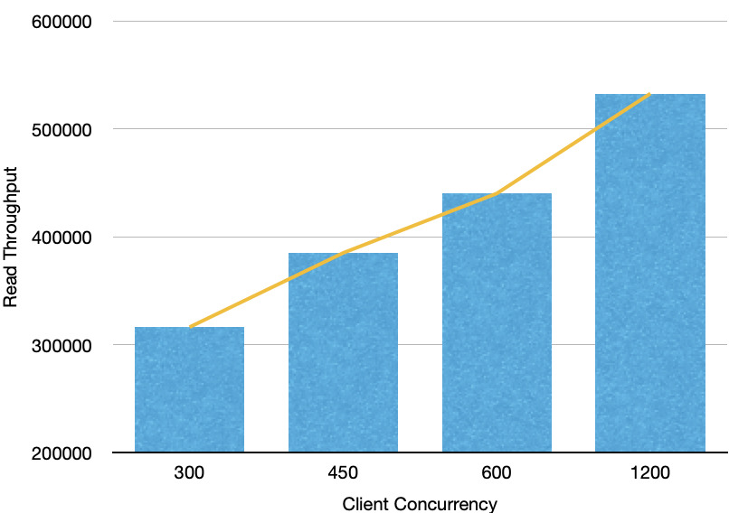
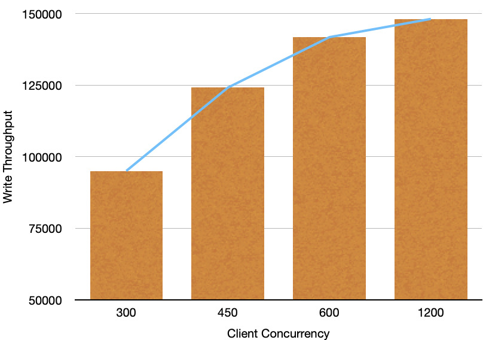
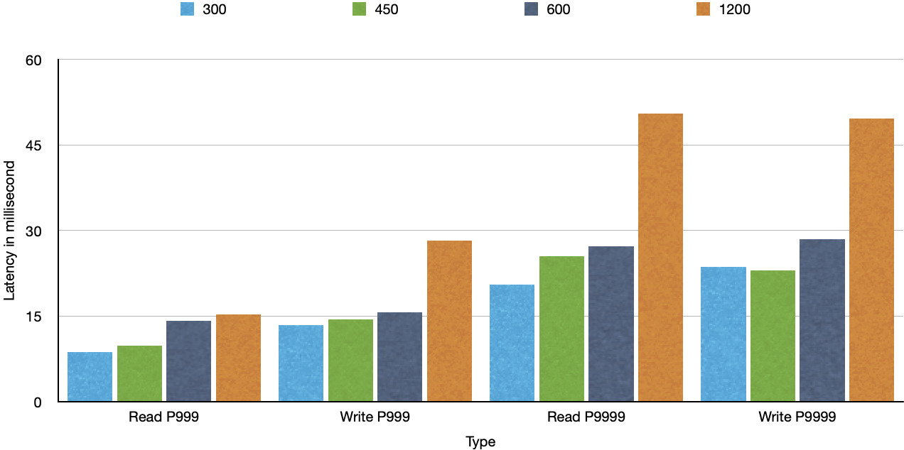
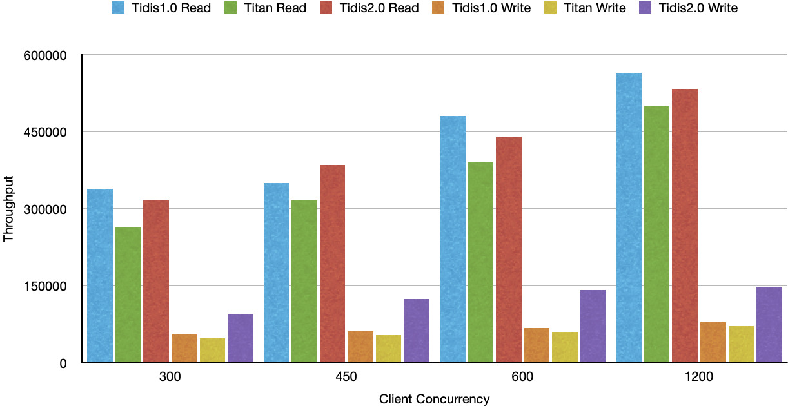
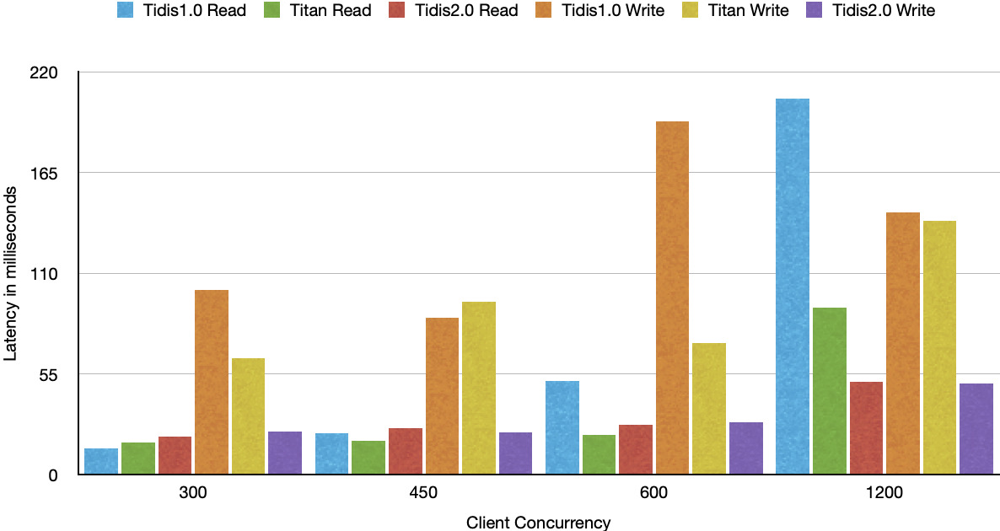

# Basic Performance

## Deploy Environment

- Platform: AWS c6gd
- Arch: aarch64
- vCPU: 16
- RAM: 16G
- Disk: NVME 800G (TiKV node only)

## Deploy topology

We deployed a minimal TiKV cluster with three storage nodes for our basic benchmark, the topology of the cluster as follows.

```
+-------+------------------------+-----------------------+
| host  | components             | comments              |
+-------+------------------------+-----------------------+
| node1 | TiKV                   | /data with local ssd  |
+-------+------------------------+-----------------------+
| node2 | TiKV                   | /data with local ssd  |
+-------+------------------------+-----------------------+
| node3 | TiKV                   | /data with local ssd  |
+-------+------------------------+-----------------------+
| node4 | Tidis                  | no extra /data mounts |
+-------+------------------------+-----------------------+
| node5 | Tidis                  | no extra /data mounts |
+-------+------------------------+-----------------------+
| node6 | Tidis                  | no extra /data mounts |
+-------+------------------------+-----------------------+
| node7 | PD & Benchmark clients | no extra /data mounts |
+-------+------------------------+-----------------------+
```

## Benchmark

### 1. Import datasets

Before the benchmark, we import a large amount of datasets for different data types, string, hash, list, set and sorted set.
30 million keys were imported totally, and this will make the benchmark results more accurate and have real reference value.

### 2. Benchmark with different concurrency

- Read throughput



- Write throughput



- Latency in different access model



### 3. Performance comparison

- Throughput (higher is better)



In the comparison, we can see the all them are in the same level in read scenario, `Tidis2.0` and `Tidis1.0`'s throughput has no much gap, and better than `Titan` obviously.
But in the write scenario, `Tidis2.0` throughput is better obviously, almost double to `Tidis` and `Titan`.

- Latency (lower is better)



In the comparison, we can see all them have not much difference in small concurrency for read, and `Tidis2.0`'s advantage shows up as the concurrency increases.
In write scenerio, latency of `Tidis2.0` are always the best and stay stable as the concurrency increases.

